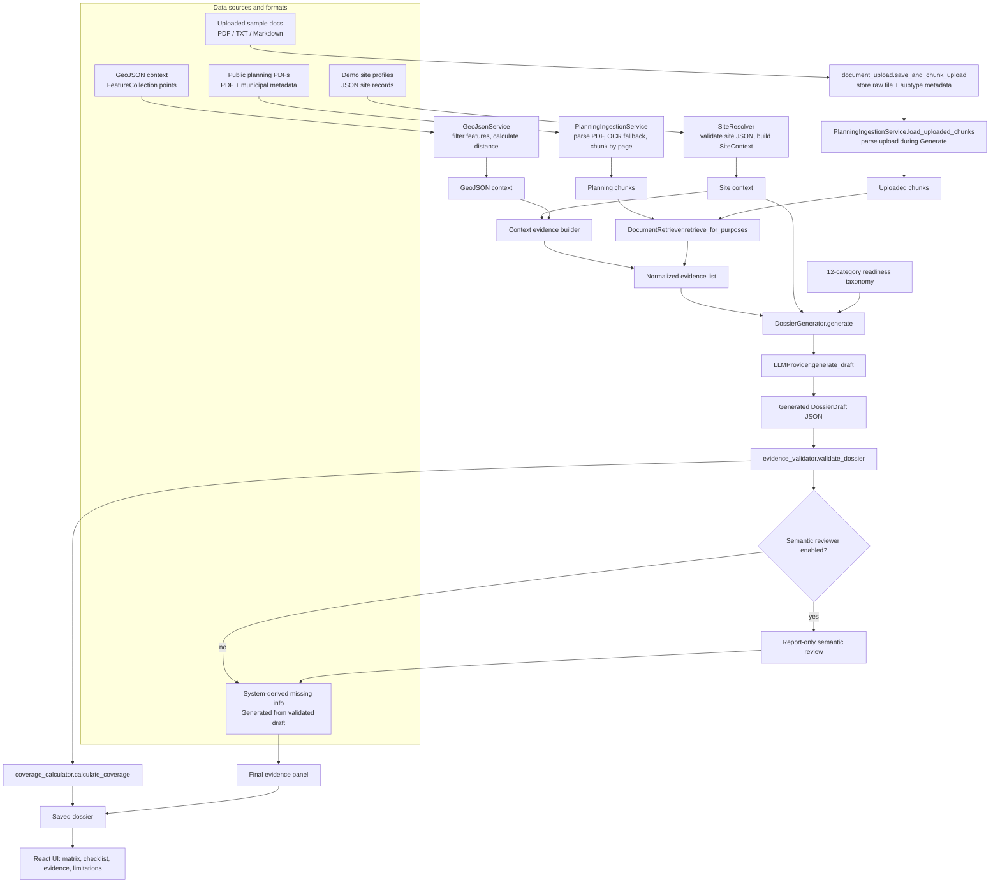

# LuxRenovate Intelligence

LuxRenovate Intelligence is a Luxembourg-focused MVP designed to help renovation professionals assess the readiness of existing buildings for renovation projects when plans, permits, technical records, and historical documentation are incomplete, outdated, or unavailable.

Rather than functioning as a generic RAG chatbot, the platform supports a structured renovation due-diligence workflow. Before visiting a site, engineers need a clear understanding of what information is already available, what critical evidence is missing, which regulatory or public constraints may affect the project, and which questions should be investigated during the inspection.

The workflow is site-centric. Users select a Luxembourg demonstration property, optionally upload supporting documents, and generate a renovation readiness dossier. The dossier consolidates available evidence, identifies documentation gaps, highlights potential constraints relevant to the property, recommends inspection priorities, and provides traceable references for every finding. The objective is not to answer arbitrary questions, but to help engineers make informed decisions about what is known, what remains uncertain, and what actions are required to progress a renovation assessment.

---

## Overview

The MVP demonstrates how heterogeneous building-related sources can be converted into a structured engineering preparation dossier:

- public planning PDFs;
- demo site profiles;
- lightweight GeoJSON site context;
- uploaded sample documents;
- system-derived missing-information evidence.

The backend normalizes these inputs into source-aware evidence records, retrieves relevant evidence through purpose-based multilingual search, sends bounded context to either the deterministic demo generator or an OpenAI-compatible LLM, validates the generated dossier, optionally runs a second LLM as a report-only semantic reviewer, and serves the result through a React + FastAPI web application.

---

## Problem and Our User

### Problem

Many renovation or technical due-diligence projects start with incomplete building knowledge. Older buildings may lack usable original drawings, structural documentation, fire-safety dossiers, MEP information, energy documents, hazardous-material assessments, or reliable historical alteration records.

Before a redesign, renovation, acquisition, or inspection, engineers need to understand:

- what public planning context is available;
- which documents or assessments are missing;
- which findings are supported by evidence;
- which uncertainties require human review;
- what should be checked during a site visit.

### Primary user

The primary user is a SECO engineer preparing renovation, technical due diligence, or inspection work for an existing building in Luxembourg.

The system does not replace the engineer. It prepares a reviewable dossier and explicitly avoids final structural, fire-safety, legal, compliance, or energy-certification decisions.

---

## Product Introduction: Functional Overview

From the user's perspective, the MVP supports this workflow:

1. **Select one of three Luxembourg demo sites.**
   The app provides three scoped demo sites so the reviewer can run the product without entering private client data.

2. **Review site context.**
   The user can see basic site information, commune, coordinates, and lightweight GeoJSON context.

3. **Optionally upload sample documents.**
   The user can upload a sample PDF, TXT, or Markdown file, such as a renovation note, inspection note, or synthetic technical document.

4. **Generate a renovation readiness dossier.**
   The user clicks **Generate**. The backend retrieves evidence, builds context, calls the configured LLM or returns a cached dossier when the inputs are unchanged, validates the output, stores the dossier, and returns it to the UI.

5. **Review the generated dossier.**
   The UI displays:
   - building summary;
   - readiness matrix;
   - evidence coverage score;
   - missing information checklist;
   - technical risk signals;
   - site inspection checklist;
   - source type coverage;
   - evidence panel;
   - limitations.

6. **Inspect the evidence behind findings.**
   Each evidence item keeps source metadata such as source type, modality, authority level, page, chunk ID, parser, support categories, and retrieval score where available.

7. **Open source files.**
   Public planning source files can be opened through source-based API routes. The UI and API use `source_id` rather than exposing arbitrary filesystem paths.

---

## Data Pipeline and Technical Choices

### Pipeline overview

The MVP pipeline has seven stages:

1. **Source registration**
   Register public planning PDFs, demo site profiles, uploaded documents, GeoJSON context, and derived system evidence.

2. **Document acquisition and parsing**
   Download or load public planning PDFs, coordinate file type and source metadata, parse text, split pages into chunks, and attach source/page metadata.

3. **Context evidence construction**
   Convert site profile and lightweight GeoJSON context into evidence records.

4. **Uploaded document processing**
   Save uploaded files and subtype metadata during upload, then parse and chunk uploaded content during Generate.

5. **Purpose-based evidence retrieval**
   Retrieve planning and uploaded-document evidence through multilingual BM25, optional embeddings, and optional rerank.

6. **Bounded dossier generation**
   Send site context, evidence objects, and a fixed readiness taxonomy to the default deterministic mock generator or to an OpenAI-compatible LLM and request structured JSON.

7. **Validation and storage**
   Validate schema, evidence references, source integrity, page ranges, claim support, taxonomy completeness, and forbidden final engineering claims. Store the validated dossier for later lookup.

8. **Optional semantic quality review**
   If configured, a second OpenAI-compatible LLM reviews the validated dossier for overclaiming, unsupported interpretations, and absence-of-evidence-to-risk mistakes. It is report-only and does not replace deterministic validation or human engineering judgement.

### Pipeline workflow



### Data sources

The local MVP uses public and sample data that can be reviewed from the repository.

| Source type | Local location | Purpose |
|---|---|---|
| Public planning PDFs | `data/raw/planning/` | Public planning and regulatory evidence for selected Luxembourg communes |
| Demo site profiles | `data/sample/demo_sites.json` | Structured site metadata for the three demo sites |
| GeoJSON context | `data/sample/demo_geospatial.geojson` | Lightweight site-context geometry and distance calculation |
| Geospatial context JSON | `data/sample/geospatial_context.json` | Human-readable public-data-style site context and limitations |
| Uploaded sample documents | `data/sample/upload_examples/` or UI upload | Simulated client-provided renovation or technical documents |
| Derived missing-information evidence | generated during dossier build | Represents missing documents or unavailable assessments for UI traceability |

The public planning documents are small enough for local review. Larger production-grade Luxembourg data sources such as national PAG datasets, Geoportail APIs, BD-Adresses, and building/geospatial datasets are referenced as production extensions, not required for the local MVP.

### Data ingestion coordination

The ingestion layer deliberately keeps raw source formats separate, then normalizes them into a shared evidence model before retrieval and generation. The coordination point is the source registry plus `EvidenceObject`, not a single raw file format.

| Source family | Input format | Ingestion coordination | Normalized output |
|---|---|---|---|
| Public planning documents | PDF files plus `planning_sources.json` metadata | Register `source_id`, commune, authority, URL, checksum, page count, parser, and document type; parse text with PyMuPDF and OCR fallback when needed; chunk by page with stable chunk IDs. | `PlanningChunk` records and `official_planning_pdf` evidence |
| Demo site profile | `data/sample/demo_sites.json` and `geospatial_context.json` | Validate structured JSON into `SiteContext`; keep address and coordinates marked as demo/approximate; carry data-quality limitations forward. | `site_profile` evidence and site context |
| Lightweight geospatial context | GeoJSON FeatureCollection | Filter point features by site/radius, calculate Haversine distance, attach `src_demo_geospatial_geojson`, and avoid cadastral or engineering inference. | `geojson` source records and `geospatial` evidence |
| Uploaded sample documents | UI upload as PDF, TXT, MD, or Markdown | Store raw file under `data/raw/uploads/`, write sidecar subtype metadata, classify or accept user-selected subtype, then parse and chunk during Generate. | `uploaded_document` evidence with subtype, modality, parser, page, and chunk metadata |
| Derived missing-information records | Generated from rule-derived missing categories before LLM/mock generation, then deduped after validation | Let generation cite missing-document evidence while preserving final UI traceability and links back to supporting original evidence where available. | `derived_missing_information` evidence |

After coordination, retrieved and generated evidence share common fields such as `evidence_id`, `source_id`, `source_type`, `source_subtype`, `modality`, `authority_level`, `evidence_role`, `page`, `chunk_id`, `parser`, `supports`, and `metadata`. This lets the UI and validators handle heterogeneous data sources through one citation model.

### Pipeline technical details and key code locations

| Pipeline step | Main files | Main classes / methods |
|---|---|---|
| Download public planning PDFs | `pipelines/download_planning_documents.py` | `main()`, `download()` |
| Parse and chunk planning PDFs | `backend/app/services/planning_ingestion.py`, `backend/app/services/document_parser.py` | `PlanningIngestionService.load_generate_chunks()`, `chunk_document()`, `parse_pdf()` |
| Register sources | `backend/app/services/source_registry.py` | `SourceRegistry.list_sources()`, `refresh_snapshot()`, `_planning_sources()`, `_uploaded_sources()`, `_geojson_source()` |
| Build site context | `backend/app/services/site_resolver.py`, `backend/app/services/geospatial.py` | `SiteResolver.build_context()`, `GeoJsonService.build_site_geojson()` |
| Convert site/GeoJSON to evidence | `backend/app/services/context_evidence.py` | `build_site_profile_evidence()`, `build_geospatial_evidence()`, `build_context_evidence()` |
| Save uploads and classify subtype | `backend/app/services/document_upload.py`, `backend/app/services/evidence_metadata.py` | `save_and_chunk_upload()`, `infer_upload_subtype()`, `normalize_upload_subtype()` |
| Retrieve evidence | `backend/app/services/document_retriever.py` | `DocumentRetriever.retrieve_for_purposes()`, `retrieve_from_chunks()` |
| Expand multilingual query terms | `backend/app/services/multilingual_terms.py` | `expand_query_tokens()`, `infer_support_categories()` |
| Optional embeddings | `backend/app/services/embedding_provider.py` | `EmbeddingProvider.embed_texts()`, `cosine_similarity()` |
| Optional rerank | `backend/app/services/rerank_provider.py` | `RerankProvider.rerank()` |
| Optional OCR fallback | `backend/app/services/ocr_provider.py` | `OCRProvider.extract_text_from_png()`, `_textract_plain_text()` |
| Generate dossier | `backend/app/services/dossier_generator.py`, `backend/app/services/llm_provider.py` | `DossierGenerator.generate()`, `build_user_prompt()`, `MockLLMProvider.generate_draft()` or `LLMProvider.generate_draft()` |
| Validate dossier | `backend/app/services/evidence_validator.py` | `validate_dossier()`, `validate_evidence_refs()`, `validate_claim_support()`, `validate_forbidden_claims()` |
| Optional semantic review | `backend/app/services/semantic_reviewer.py` | `SemanticReviewer.review()`, `build_review_prompt()` |
| Calculate evidence coverage | `backend/app/services/coverage_calculator.py` | `calculate_coverage()` |
| Store and retrieve dossiers | `backend/app/services/dossier_store.py` | `save_dossier()`, `load_dossier()`, `load_cached_dossier()` |

### Validation checks

The MVP includes validation because this is a technical-control workflow, not an open-ended chatbot.

The backend validates:

- Pydantic schema correctness;
- all referenced evidence IDs exist;
- planning findings, risk signals, and inspection checklist items cite evidence;
- evidence sources exist in the source registry;
- PDF page references stay within registered source page ranges;
- planning claims are backed by official planning-document sources;
- available or partial matrix items must reference evidence;
- hard engineering categories cannot be marked available from unsuitable evidence types;
- all 12 readiness taxonomy categories are present;
- forbidden final claims such as 'safe', 'approved', 'compliant', or 'structurally sound' are rejected.

Important limitation: the validator reduces unsupported claims, but it does not prove factual correctness. Final engineering judgement remains with the human engineer.

### Technical decisions

- **FastAPI + Pydantic** keep the backend typed and easy to validate.
- **React + TypeScript** provides a minimal client-facing product workspace.
- **Local JSON/JSONL** keeps the MVP reproducible and easy to inspect.
- **PyMuPDF** is sufficient for text-based public PDFs.
- **Multilingual BM25** is the default retrieval method because it works without external services and supports mixed English/French/German/Dutch terminology.
- **Embeddings, rerank, and OCR are optional integrations.** They are abstracted behind providers so the MVP can run locally while production deployments can use managed cloud services.
- **SourceRegistry + EvidenceObject** make citations and evidence traceability explicit before moving to production databases.
- **GeoJSON support is intentionally lightweight.** It provides coordinate and distance context, not cadastral, structural, or engineering-grade inference.
- **The evidence coverage score is not a risk, safety, compliance, or renovation-feasibility score.** It only summarizes evidence availability.

### Deterministic readiness-matrix rules

The readiness matrix is assigned before generation by a deterministic rule engine. Evidence objects are matched against each taxonomy category by source type, document subtype, evidence role, and selected content terms. The resulting `status` and `evidence_refs` are locked into the prompt.

The LLM, or the deterministic mock generator, only writes the human-readable summaries, recommended next actions, findings, risk signals, checklist items, and limitations around that rule-derived matrix. Validators then verify that the generated dossier did not change any rule-derived matrix category, label, status, or evidence reference. Missing categories also seed missing-information checklist items deterministically.

Implemented control flow:

```text
evidence objects
-> deterministic readiness-matrix status assignment
-> derived missing-information evidence
-> bounded LLM summary/checklist generation
-> validation and audit output
-> optional report-only semantic review
```

---

## AI Highlights

The AI layer is deliberately bounded.

Generation receives:

- selected site context;
- retrieved evidence objects;
- source metadata;
- a fixed 12-category readiness taxonomy;
- instructions to return structured JSON only.

The main AI-related implementation points are:

| Capability | File / method |
|---|---|
| LLM request construction | `backend/app/services/dossier_generator.py::build_user_prompt()` |
| Demo-mode generation | `backend/app/services/llm_provider.py::MockLLMProvider.generate_draft()` |
| Structured LLM call | `backend/app/services/llm_provider.py::LLMProvider.generate_draft()` |
| Optional second-LLM semantic review | `backend/app/services/semantic_reviewer.py::SemanticReviewer.review()` |
| JSON extraction and schema validation | `backend/app/services/llm_provider.py::extract_json_object()`, Pydantic models in `backend/app/models/schemas.py` |
| Dossier orchestration | `backend/app/services/dossier_generator.py::DossierGenerator.generate()` |
| Evidence validation | `backend/app/services/evidence_validator.py::validate_dossier()` |
| Forbidden final-claim guardrail | `backend/app/services/evidence_validator.py::validate_forbidden_claims()` |

The LLM is not treated as the source of truth. It transforms retrieved evidence into a structured, reviewable dossier. The system still requires human validation for engineering, structural, fire-safety, legal, and compliance questions.

The MVP includes an offline evaluation layer for deterministic regression and semantic boundary checks. It runs in mock mode without cloud credentials and measures retrieval source coverage, rule-derived matrix behavior, validator outcomes, dossier consistency, semantic-review status, token usage, and dangerous overclaiming boundaries. See `docs/evaluation.md`.

---

## Run Locally

### Reviewer demo path

For the fastest demo, use Docker Compose from the repository root:

```bash
docker compose up
```

Then open:

```text
http://localhost:5173
```

With `.env.example` or no custom LLM configuration, Docker Compose starts the backend in deterministic mock generation mode:

```env
API_AUTH_ENABLED=true
API_AUTH_TOKEN=dev-demo-token-change-me
CORS_ORIGINS=http://localhost:5173,http://127.0.0.1:5173
CORS_ALLOW_CREDENTIALS=false
CORS_METHODS=GET,POST
CORS_HEADERS=Content-Type,X-API-Key
VITE_API_TIMEOUT_MS=240000
LLM_PROVIDER=mock
LLM_MOCK_MODE=true
EXTERNAL_API_MAX_ATTEMPTS=3
EXTERNAL_API_RETRY_DELAY_SECONDS=0.25
UPLOAD_MAX_BYTES=10485760
```

Docker Compose forwards local `.env` LLM values into the backend container. If you set `LLM_MOCK_MODE=false`, `LLM_PROVIDER`, `LLM_API_KEY`, `LLM_BASE_URL`, `LLM_MODEL`, and `LLM_RESPONSE_FORMAT` locally, Compose uses those values instead of the mock defaults.

The optional semantic reviewer is disabled by default:

```env
SEMANTIC_REVIEW_PROVIDER=disabled
```

To test a second LLM as a quality-control pass, configure it separately from the generation model:

```env
SEMANTIC_REVIEW_PROVIDER=openai_compatible
SEMANTIC_REVIEW_API_KEY=<your-review-token>
SEMANTIC_REVIEW_BASE_URL=https://<your-provider-host>/<openai-compatible-path>
SEMANTIC_REVIEW_MODEL=<your-review-model-or-serving-endpoint-name>
SEMANTIC_REVIEW_RESPONSE_FORMAT=json_object
```

The reviewer does not act as a router, planner, or autonomous agent. It produces structured warnings for overclaiming, unsupported interpretations, grounding issues, and absence-of-evidence-to-risk mistakes. Deterministic validator failures still block the dossier; semantic reviewer warnings are shown as review metadata.

No LLM API key is required for the demo. The reviewer can select a Luxembourg demo site, optionally upload a file from `data/sample/upload_examples/`, click **Generate**, and review the readiness matrix, coverage score, missing-information checklist, inspection checklist, evidence panel, source links, and limitations.

Local API routes are protected by a simple API key gate. The default demo token is intentionally non-secret and exists only so the repo runs out of the box:

```powershell
$headers = @{ "X-API-Key" = "dev-demo-token-change-me" }
Invoke-RestMethod http://127.0.0.1:8000/api/sites -Headers $headers
```

Set `API_AUTH_TOKEN` to your own local value before sharing or deploying the app. `/health` remains public for liveness checks. Source file links use the same token as a query parameter because browsers cannot attach custom headers to direct PDF/file links.

Use this framing when presenting the demo: the product is exercising retrieval, evidence normalization, validation, storage, and the full dossier UI; the generated narrative is deterministic demo output so the workflow is reliable without external credentials. Real LLM generation is available by disabling mock mode and setting the LLM environment variables below.

### 1. Setup

Install Python dependencies from the repository root:

```bash
python -m pip install -r requirements.txt
python -m pip install -e .
```

Install frontend dependencies:

```bash
cd frontend
npm install
cd ..
```

Create a local `.env` file:

```bash
cp .env.example .env
```

On Windows PowerShell:

```powershell
Copy-Item .env.example .env
```

By default, the backend uses deterministic mock generation even without a local `.env`, and `.env.example` keeps that same default. Reviewers can click **Generate** without any external API key. The mock path still runs retrieval, evidence normalization, validation, storage, and the UI review flow, but it does not call an LLM and its narrative is intentionally demo-grade.

Edit `.env` if you want to run real dossier generation with an external OpenAI-compatible LLM endpoint. Set `LLM_PROVIDER` to your provider label, set `LLM_MOCK_MODE=false`, and provide provider-specific values locally.

Recommended production-style variables are placeholders, not committed credentials:

```env
API_AUTH_ENABLED=true
API_AUTH_TOKEN=<your-local-api-token>
CORS_ORIGINS=http://localhost:5173,http://127.0.0.1:5173
CORS_ALLOW_CREDENTIALS=false
CORS_METHODS=GET,POST
CORS_HEADERS=Content-Type,X-API-Key
VITE_API_TIMEOUT_MS=240000

LLM_PROVIDER=<your-openai-compatible-provider>
LLM_MOCK_MODE=false
LLM_API_KEY=<your-token>
LLM_BASE_URL=https://<your-provider-host>/<openai-compatible-path>
LLM_MODEL=<your-chat-model-or-serving-endpoint-name>
LLM_RESPONSE_FORMAT=json_object
EXTERNAL_API_MAX_ATTEMPTS=3
EXTERNAL_API_RETRY_DELAY_SECONDS=0.25
UPLOAD_MAX_BYTES=10485760

SEMANTIC_REVIEW_PROVIDER=disabled
# Optional second LLM:
# SEMANTIC_REVIEW_PROVIDER=openai_compatible
# SEMANTIC_REVIEW_API_KEY=<your-review-token>
# SEMANTIC_REVIEW_BASE_URL=https://<your-provider-host>/<openai-compatible-path>
# SEMANTIC_REVIEW_MODEL=<your-review-model-or-serving-endpoint-name>
# SEMANTIC_REVIEW_RESPONSE_FORMAT=json_object

EMBEDDING_BASE_URL=https://<your-provider-host>/<embedding-path>
EMBEDDING_MODEL=<your-embedding-model-or-serving-endpoint-name>

RERANK_PROVIDER=<your-rerank-provider-or-disabled>
RERANK_MODEL=<your-rerank-model-id-or-arn>
RERANK_AWS_REGION=<your-region-if-applicable>

OCR_PROVIDER=<your-ocr-provider-or-disabled>
OCR_MODEL=<your-ocr-model-or-provider-label>
OCR_AWS_REGION=<your-region-if-applicable>
```

For a Databricks OpenAI-compatible serving endpoint, use the workspace serving-endpoints base URL and the serving endpoint name as the model:

```env
LLM_PROVIDER=openai_compatible
LLM_MOCK_MODE=false
LLM_BASE_URL=https://<your-workspace-host>/serving-endpoints
LLM_MODEL=<your-serving-endpoint-name>
LLM_RESPONSE_FORMAT=json_object
```

After changing `.env`, restart the backend process. Environment settings are loaded at process startup.

Embedding, rerank, and OCR are optional. The default local retrieval path uses multilingual BM25.

### 2. Launch the app

Start the backend:

```bash
uvicorn app.main:app --reload --port 8000
```

Start the frontend in another terminal:

```bash
cd frontend
npm run dev
```

Open:

```text
http://localhost:5173
```

You can also run both services with Docker Compose:

```bash
docker compose up
```

### 3. Use the UI

In the browser:

1. Open `http://localhost:5173`.
2. Select one of the three Luxembourg demo sites.
3. Review the site context and lightweight map context.
4. Optional: upload a sample file from `data/sample/upload_examples/`.
5. Click **Generate**.
6. Review the readiness matrix, coverage score, missing information, risk signals, inspection checklist, evidence panel, and limitations.
7. Open source files from the evidence/source area where available.

With the default mock configuration, step 5 generates a demo dossier without credentials. If you disable mock mode without configuring a real LLM, step 5 returns a clear `llm_not_configured` error while the rest of the app remains usable for reviewing the data pipeline, source registry, site context, uploads, and retrieval flow.

### Evaluation

Run the offline evaluation layer in mock mode:

```powershell
.\.venv\Scripts\python.exe -m app.evaluation.runner --mode mock
```

The evaluation runner executes two deterministic cases and one semantic boundary case. It checks retrieval source coverage, rule-derived readiness matrix behavior, locked matrix consistency, grounding rates, forbidden final claims, coverage-score consistency, derived missing-information evidence, and the absence-of-evidence-not-risk semantic boundary. Reports are written to `data/evaluation/runs/` and are ignored by git. See `docs/evaluation.md`.

### Token and generation monitoring

Each generated dossier includes token and generation usage metadata. In mock mode, no external LLM call is made and external token usage is reported as zero. In real LLM mode, the backend records provider-reported token usage when available and falls back to a lightweight local estimate otherwise.

The UI displays generation mode, provider, model, whether an external LLM was called, and total reported or estimated tokens. If the semantic reviewer is enabled, the UI also displays reviewer status, provider/model, warning count, and reviewer token usage. This is an MVP observability feature for transparency and reproducibility, not a billing system.

### 4. Refresh public planning PDFs

The repository includes local public planning PDFs. To refresh them:

```bash
python -X utf8 -m pipelines.download_planning_documents
```

To generate planning chunks as an audit/debug artifact:

```bash
python -X utf8 -m pipelines.ingest_planning_documents
```

The Generate endpoint uses a source-hash checked chunk cache when available. If the cache is missing or stale, it parses and chunks the raw planning PDFs again.

### 5. API

Backend health and docs:

```text
GET http://localhost:8000/health
GET http://localhost:8000/docs
```

`/health` is a public liveness endpoint and intentionally returns only minimal status. Detailed provider/config diagnostics are protected by the API key:

```text
GET /api/diagnostics
```

Main API routes:

```text
GET  /api/sites
GET  /api/sites/{site_id}/context
GET  /api/sites/{site_id}/geojson
POST /api/documents/upload
GET  /api/evidence?site_id=...&query=...
GET  /api/sources
GET  /api/sources/{source_id}/file
POST /api/dossiers/generate
GET  /api/dossiers/{dossier_id}
```

### 6. Tests

Run backend tests:

```bash
pytest
```

Build frontend:

```bash
cd frontend
npm run build
```

---

## Out of Scope for the MVP

The MVP does not provide:

- final structural safety decisions;
- fire-safety approval;
- legal or planning-compliance judgement;
- energy certification;
- cadastral or ownership verification;
- full as-built reconstruction;
- SECO internal data integration;
- customer confidential data processing;
- production authentication, RBAC, audit logs, or enterprise monitoring.

---

## What Would Be Kept in Production

The following parts are production-relevant:

- site-centric product workflow;
- source registry;
- source-aware evidence object model;
- fixed readiness taxonomy;
- bounded structured AI generation;
- evidence-reference validation;
- forbidden final-claim validation;
- source type coverage;
- human-in-the-loop positioning.

---

## What Would Be Rebuilt in Production

The following MVP components should be rebuilt or replaced in a production version:

- replace local JSON/JSONL with PostgreSQL/PostGIS, Delta tables, or another governed data store;
- replace local uploads with governed document storage;
- replace local source files with managed object storage;
- add RBAC, document-level permissions, audit logging, prompt logging, and data-retention policies;
- use production OCR for scanned drawings, reports, and image-heavy PDFs;
- use managed vector search and monitored retrieval pipelines;
- expand the readiness rule engine with versioned policies, confidence thresholds, and reviewer-tunable rule packs;
- expand the evaluation layer with broader semantic cases, human-reviewed labels, retrieval precision/recall, prompt/model regression tracking, real-LLM report-only runs, and user-facing usefulness checks;
- integrate SECO historical inspection reports, defect observations, photos, measurements, drawings, and project metadata.

---

## Three-Month Direction

### Month 1: Improve the MVP and collect user feedback

- Improve the UI/UX based on engineer feedback.
- Observe whether users understand the readiness matrix, source type coverage, evidence panel, and limitations.
- Collect feedback on which dossier sections are useful and which are missing.
- Improve document upload experience and source-file inspection.
- Strengthen existing features before adding many new ones.

### Month 2: Strengthen accuracy, stability, rule logic, and evaluation

- Expand the deterministic evaluation set with more representative demo dossiers.
- Expand retrieval evaluation: correct source, correct commune, correct page, correct evidence role, and labeled expected evidence where stable.
- Expand generation evaluation: required evidence references, no forbidden claims, stable limitations, checklist relevance, and locked-matrix preservation.
- Expand rule-engine evaluation: whether each readiness-matrix status is consistent with the available evidence and missing-information rules.
- Add more semantic regression cases for faithfulness, relevance, actionability, internal consistency, and absence-of-evidence-not-risk boundaries.
- Add optional real-LLM evaluation runs as report-only outputs for manual review, not CI hard failures.
- Expand the rule-based readiness-matrix engine with more document subtypes, confidence handling, and explicit `unknown` / `not_applicable` conditions.
- Add regression tests for prompts, validators, source-type handling, rule-engine outputs, and sample dossier outputs.
- Add better monitoring around failed parsing, failed generation, missing evidence, validation errors, and rule-engine conflicts.
- Expand document subtype classification and matrix consistency checks.

### Month 3: Plan production scale and internal data integration

- Estimate expected user volume, document volume, and dossier generation frequency.
- Decide whether local processing remains sufficient or whether distributed processing is needed.
- Evaluate production storage and processing options such as managed lakehouse tables, PostgreSQL/PostGIS, object storage, and scheduled jobs.
- Plan deployment resources for backend, frontend, document processing, OCR, retrieval, and LLM serving.
- Design the first SECO internal-data integration: historical inspection reports, defect observations, photos, measurements, and project metadata.
- Prototype similar-case retrieval and experience-enhanced inspection checklist generation from governed internal data.
- Add human expert labels and review rubrics for semantic evaluation before treating narrative quality metrics as production gates.

---

## Production Architecture Direction

The local MVP is intentionally lightweight. A production version would likely use:

- managed data and AI platforms for Bronze/Silver/Gold data layers, batch processing, model serving, vector search, and governance;
- object storage for raw documents and generated artifacts;
- production OCR service for scanned files;
- **PostgreSQL/PostGIS** for structured site, geometry, dossier, and evidence metadata;
- **RBAC and audit logs** for controlled access to customer and SECO internal data;
- **rule-engine services** for deterministic readiness-matrix status assignment and missing-information logic;
- **evaluation pipelines** for retrieval, generation, validation, rule-engine behavior, and end-to-end regression checks.

A possible mapping:

| Layer | Production content |
|---|---|
| Bronze | raw PDFs, uploaded files, GeoJSON, historical reports, photos, measurements |
| Silver | parsed chunks, evidence objects, source registry, site context, defect observations |
| Gold | readiness dossiers, coverage scores, checklists, validation results, analytics |

---

## Repository Structure

```text
backend/      FastAPI backend, services, schemas, validators, tests
frontend/     React + TypeScript UI
pipelines/    download, ingestion, and index-building scripts
data/         raw, processed, sample, uploaded, and stored dossier data
docs/         architecture, trade-offs, evaluation, and roadmap notes
```
